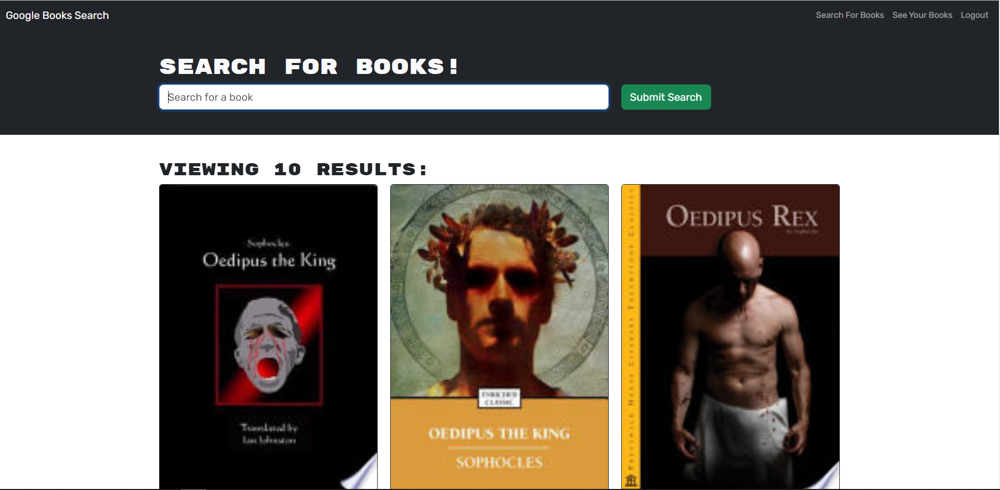

# <Your-Project-Title>

## Description

The motivation behind this project was to create a user-friendly book search engine that allows avid readers to easily discover new books to read and maintain a list of books they want to purchase. This project was built to address the need for a convenient platform where users can search for books, create accounts, save their favorite books, and manage their reading lists.

I refactored the code to support graphQL instead of the existing RESTful API backend.

## Installation

Fork the existing repo and run npm i

## Usage

Sign up or login with the link in the top right of the page. Once you've logged in you can search for book and add them to your profile by clicking the "Save this Book!" button. Click the "See Your Books" link in the top right to see your saved books. You can delete saved books from this page as well.

## Features

Search the Google Books API
Save books from the home page
Review and delete your saved books

